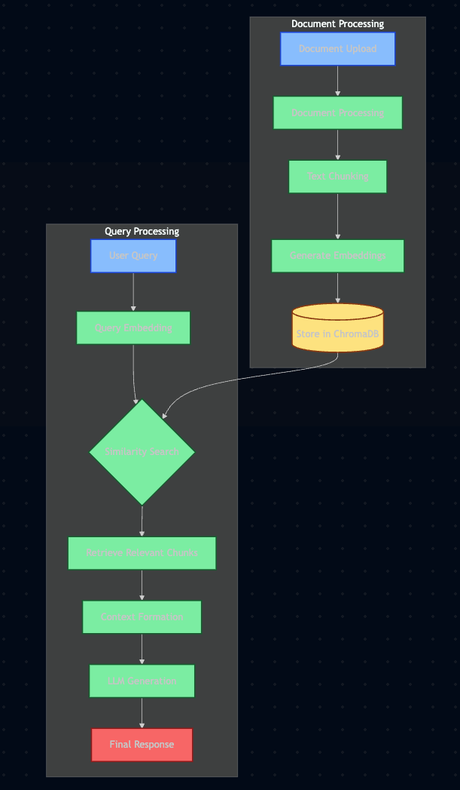

# RAG with ChromaDB - Implementation 🚀

A complete Retrieval Augmented Generation (RAG) system using **completely free** APIs and tools.



## ✨ Features

- **Free Groq API** (6,000 tokens/minute)
- **ChromaDB** Vector Database
- **Sentence Transformers** Embeddings
- **Gradio** Interactive UI
- **Multi-format Support**: PDF, TXT, DOCX, MD, HTML

## 🎯 What You'll Learn

1. **Document Processing**
   - PDF, TXT, Markdown ingestion
   - Smart chunking strategies
   - Metadata extraction

2. **Vector Embeddings**
   - Local embedding generation
   - Efficient storage
   - Similarity computation

3. **Semantic Search**
   - Context-aware retrieval
   - Relevance ranking
   - Source attribution

4. **LLM Integration**
   - Groq API integration
   - Context window optimization
   - Response generation

5. **User Interface**
   - Interactive chat
   - Document upload
   - Source highlighting

## 📸 Screenshots


### User Interface


### Document Upload Interface


### Chat Interface


## 🚀 Quick Start

### 1. Setup Environment
```bash
# Clone and navigate
git clone <repository-url>
cd 01-rag-with-chroma

# Create and activate virtual environment
python -m venv venv
source venv/bin/activate  # Windows: venv\Scripts\activate

# Install dependencies
pip install -r requirements.txt
```

### 2. Get Free API Keys
1. **Groq API** (30-second setup)
   - Visit [Groq Console](https://console.groq.com/keys)
   - Sign up and copy API key
   - Add to `.env`: `GROQ_API_KEY=your_key_here`

2. **Alternative: Google AI**
   - Visit [Google AI Studio](https://makersuite.google.com/app/apikey)
   - Create API key
   - Add to `.env`: `GOOGLE_AI_API_KEY=your_key_here`

### 3. Add Documents
```bash
# Create data directory
mkdir -p data/sample_docs

# Add your documents
cp your_documents.* data/sample_docs/
```

### 4. Run the Application
```bash
# Navigate to source directory
cd src

# Start the application
python app.py
```

## 📁 Project Structure 

### Navigate to project directory

```sh
    cd 01AICodeSnippets
```

### Create virtual environment

```sh
    python -m venv venv
```
### Activate virtual environment
#### For macOS/Linux:
```sh
    source venv/bin/activate
```
#### For Windows:
```sh
    venv\Scripts\activate 
```
### Install required packages
```sh
    pip install -r requirements.txt
``` 

### Create .env file
```sh
    touch .env
```
### Add your API keys (use any text editor)
```sh
    echo "# Choose one of these free APIs
    GROQ_API_KEY=your_groq_api_key_here
    GOOGLE_AI_API_KEY=your_google_ai_key_here" > .env   
```

### Create directories for documents and database
```sh
    mkdir -p data/sample_docs uploaded_docs chroma_db 
```

## Key Points
1. RAG (Retrieval Augmented Generation) combines document retrieval with AI generation
2. We're using free APIs like Groq and Google AI
3. ChromaDB provides vector storage capabilities
4. The system supports multiple document formats

## Benefits
- Accurate responses based on your documents
- No cost (using free APIs)
- Easy to use interface
" > data/sample_docs/test.md 