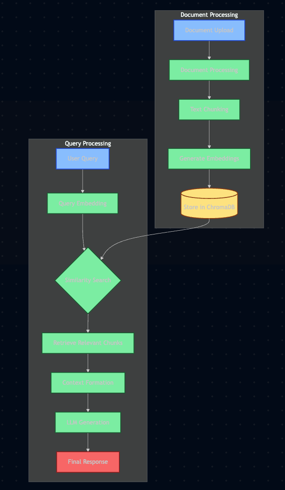

# RAG System with ChromaDB and Free APIs - Technical Documentation

## 🔄 System Flow Diagram



## 🏗️ Architecture Components

### 1. Document Processing Layer
- **Supported Formats**: PDF, DOCX, TXT, MD, HTML, PPTX
- **Processing Pipeline**:
  - Text extraction with format-specific handlers
  - Chunking with overlap for context preservation
  - Metadata extraction (filename, size, type)
- **Technologies Used**:
  - `PyPDF2`: PDF processing
  - `python-docx`: Word document processing
  - `beautifulsoup4`: HTML processing
  - Custom chunking algorithms

### 2. Vector Store Layer (ChromaDB)
- **Purpose**: Efficient similarity search and document retrieval
- **Features**:
  - Local vector database
  - Persistent storage
  - Fast similarity search
  - Metadata filtering
- **Implementation**:
  - Uses sentence-transformers for embeddings
  - Cosine similarity for matching
  - Batch processing for large documents

### 3. LLM Integration Layer
- **Primary Provider**: Groq API
  - Model: `allam-2-7b`
  - Fast inference (6k tokens/minute free)
- **Fallback Provider**: Google AI (Gemini)
  - Model: `gemini-pro`
  - 15 requests/minute free
- **Features**:
  - Automatic provider selection
  - Error handling and retries
  - Context-aware prompting

### 4. User Interface Layer
- **Technology**: Gradio
- **Features**:
  - Document upload interface
  - Real-time chat
  - Source attribution
  - System status monitoring
  - Progress tracking

## 🛠️ Technical Stack

### Core Dependencies
```python
# AI/ML
groq>=0.4.0                    # Primary LLM API
google-generativeai>=0.3.0     # Backup LLM API
sentence-transformers>=2.2.0   # Embeddings
chromadb>=0.4.0               # Vector Database

# Document Processing
pypdf2>=3.0.0,<4.0.0          # PDF Processing
python-docx>=0.8.11           # Word Documents
python-pptx>=0.6.21           # PowerPoint
beautifulsoup4>=4.12.0        # HTML

# UI/UX
gradio>=3.50.0                # Web Interface
streamlit>=1.28.0             # Optional UI

# Utilities
psutil>=5.9.0                 # Resource Management
tqdm>=4.65.0                  # Progress Tracking
```

## 💡 Use Cases & Applications

### 1. Document Management Systems
- **Features**:
  - Intelligent document search
  - Content summarization
  - Question answering
- **Applications**:
  - Legal document analysis
  - Research paper exploration
  - Technical documentation

### 2. Knowledge Base Systems
- **Features**:
  - Automated knowledge extraction
  - Context-aware responses
  - Source attribution
- **Applications**:
  - Corporate knowledge bases
  - Educational resources
  - Support documentation

### 3. Content Analysis
- **Features**:
  - Multi-document analysis
  - Theme extraction
  - Content summarization
- **Applications**:
  - Market research
  - Academic research
  - Content curation

### 4. Customer Support
- **Features**:
  - Automated response generation
  - Document-based answers
  - Source verification
- **Applications**:
  - Help desk automation
  - FAQ systems
  - Support ticket analysis

## 🔧 System Requirements

### Hardware Requirements
- **Minimum**:
  - 4GB RAM
  - 2 CPU cores
  - 10GB storage
- **Recommended**:
  - 8GB+ RAM
  - 4+ CPU cores
  - SSD storage

### Software Requirements
- Python 3.9+
- Virtual environment
- Internet connection (for API access)

## 🚀 Performance Metrics

### Processing Speed
- Document ingestion: ~1-2 MB/second
- Query response: 2-5 seconds
- Embedding generation: ~1000 chunks/minute

### Resource Usage
- Memory: 500MB - 2GB (depending on load)
- Storage: ~100MB per 1GB of documents
- CPU: Moderate during processing

## 🔐 Security Considerations

### Data Privacy
- All processing done locally
- No data sent to external services except queries
- API keys stored in environment variables

### API Security
- Rate limiting implemented
- Error handling for API failures
- Automatic fallback systems

## 🎯 Best Practices

### Document Processing
1. Pre-process documents for optimal chunking
2. Use appropriate chunk sizes (1000-1500 tokens)
3. Maintain context with proper overlap

### Query Optimization
1. Use specific queries
2. Implement retry mechanisms
3. Cache frequent queries

### System Maintenance
1. Regular database cleanup
2. Monitor resource usage
3. Update dependencies

## 📈 Future Enhancements

### Planned Features
1. Multi-modal support (images, audio)
2. Advanced caching system
3. Custom embedding models
4. Improved error handling

### Potential Integrations
1. Additional vector databases
2. More LLM providers
3. Advanced UI features
4. Analytics dashboard

## 🤝 Contributing Guidelines

### Development Setup
1. Fork the repository
2. Create virtual environment
3. Install dependencies
4. Run tests

### Code Standards
- PEP 8 compliance
- Type hints
- Comprehensive documentation
- Unit tests

## 📚 Additional Resources

### Documentation
- [ChromaDB Documentation](https://docs.trychroma.com/)
- [Groq API Documentation](https://console.groq.com/docs)
- [Sentence Transformers](https://www.sbert.net/)


## 🆘 Troubleshooting

### Common Issues
1. Memory usage during large document processing
2. API rate limiting
3. PDF extraction errors
4. Embedding generation issues

### Solutions
1. Batch processing implementation
2. Provider fallback system
3. Robust error handling
4. Progress monitoring

## 📊 System Monitoring

### Key Metrics
- Document processing speed
- Query response time
- Memory usage
- API quota usage

### Logging
- Processing status
- Error tracking
- Performance metrics
- System health 