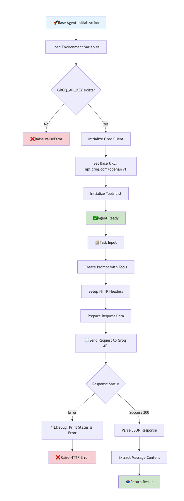
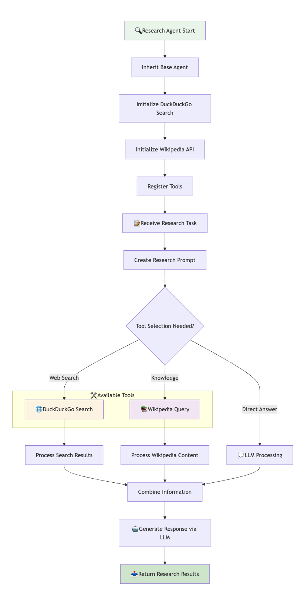
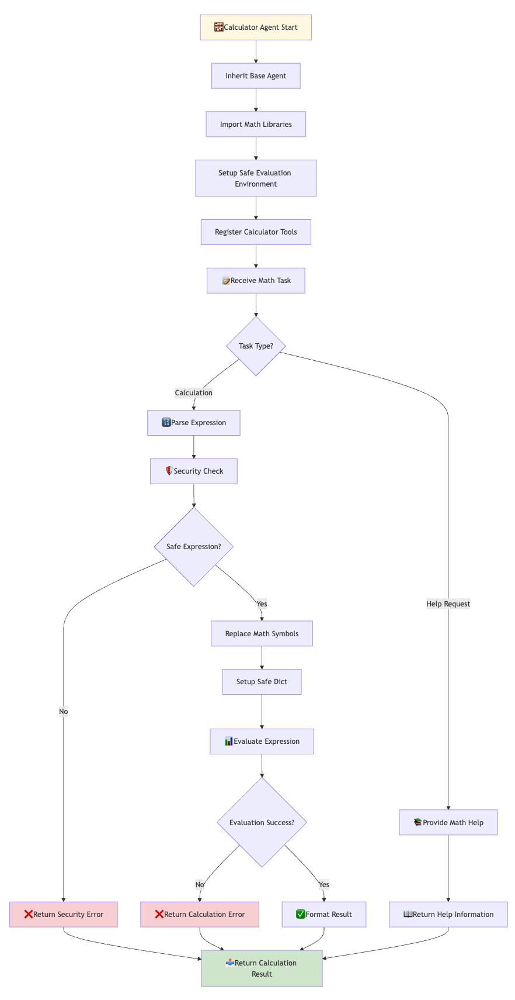
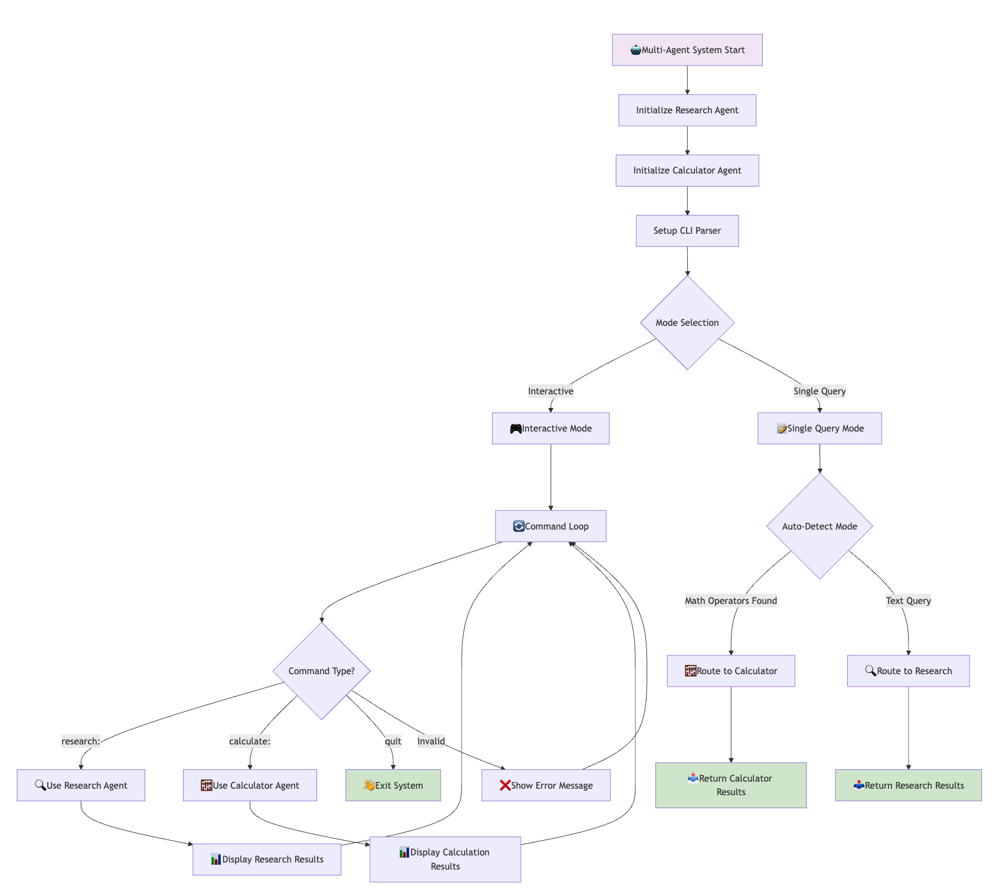
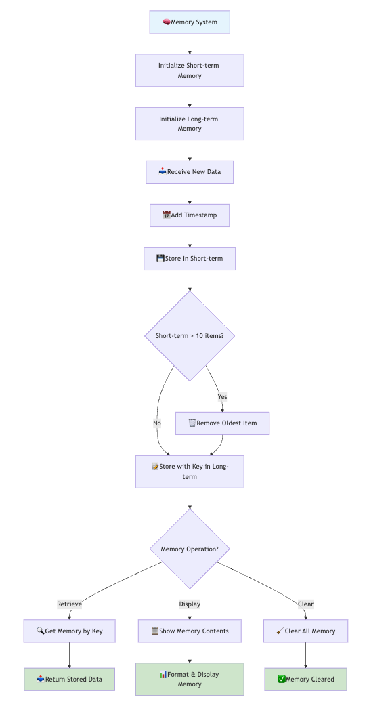
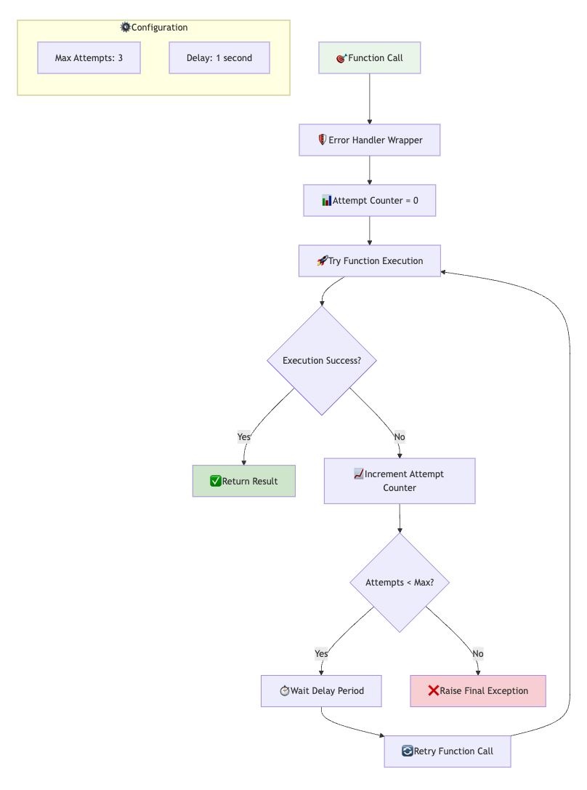
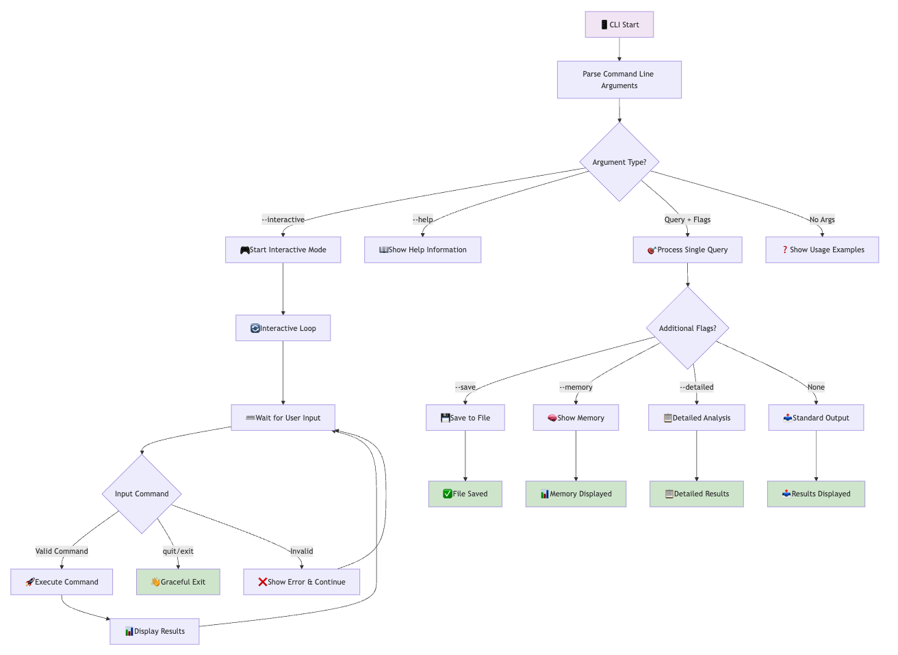
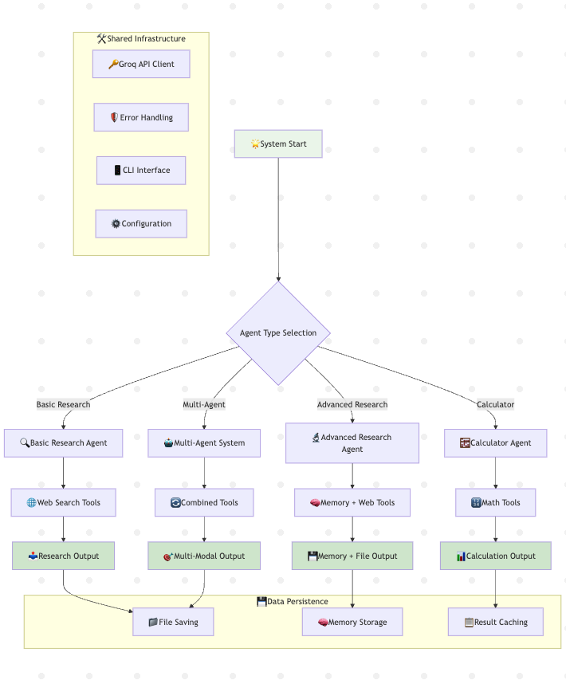
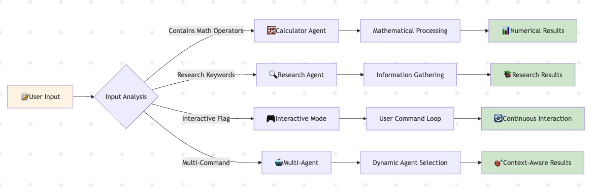

# Agent Flow Diagrams 🔄

This document contains detailed flow diagrams for all agents in the Agentic AI system.

## 🏗️ Base Agent Architecture

## 🔍 Research Agent Flow

## 🧮 Calculator Agent Flow

## 🤖 Multi-Agent System Flow

## 🧠 Memory Management Flow

## 🔄 Error Handling & Retry Flow

## 📱 CLI Interface Flow

## 🌐 Complete System Integration Flow

## 🎯 Agent Decision Matrix

---

## 📋 Flow Summary

### 🔍 **Research Agent**
1. **Initialize** → Setup tools (DuckDuckGo, Wikipedia)
2. **Receive Task** → Parse research query
3. **Tool Selection** → Choose appropriate information source
4. **Data Gathering** → Execute search/retrieval
5. **Processing** → Combine and analyze information
6. **Response** → Generate comprehensive answer

### 🧮 **Calculator Agent**
1. **Initialize** → Setup math environment and security
2. **Receive Expression** → Parse mathematical input
3. **Validation** → Security and syntax checking
4. **Evaluation** → Safe mathematical computation
5. **Result** → Format and return calculation

### 🤖 **Multi-Agent System**
1. **Initialize** → Setup both research and calculator agents
2. **Mode Detection** → Analyze input type automatically
3. **Route Request** → Direct to appropriate agent
4. **Process** → Execute using selected agent
5. **Response** → Return unified result

### 🧠 **Memory System**
1. **Storage** → Short-term (10 items) + Long-term (keyed)
2. **Management** → Automatic cleanup and organization
3. **Retrieval** → Query-based memory access
4. **Persistence** → File-based result saving

These diagrams show how each component works individually and how they integrate to create a comprehensive agentic AI system! 🚀 