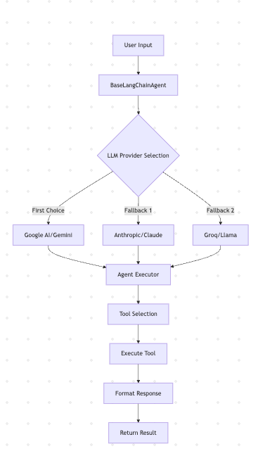
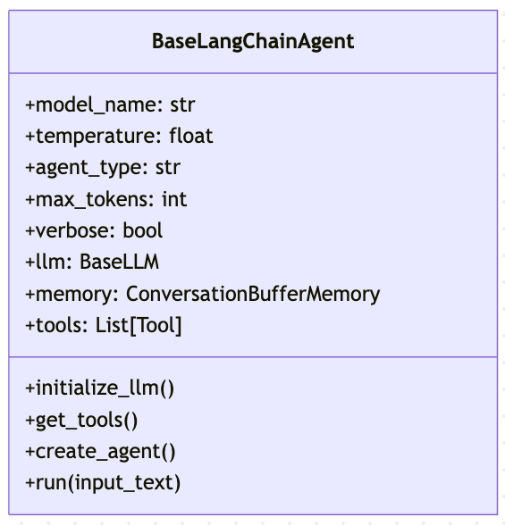
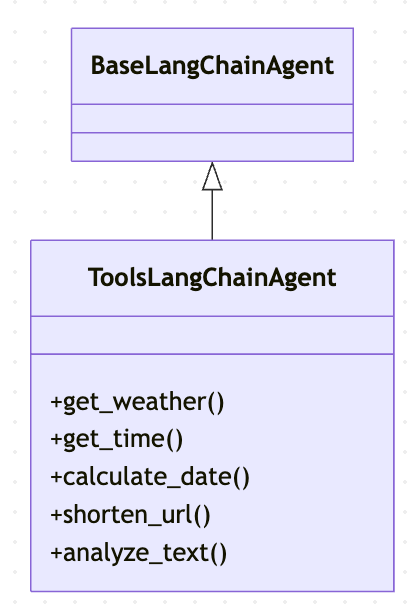
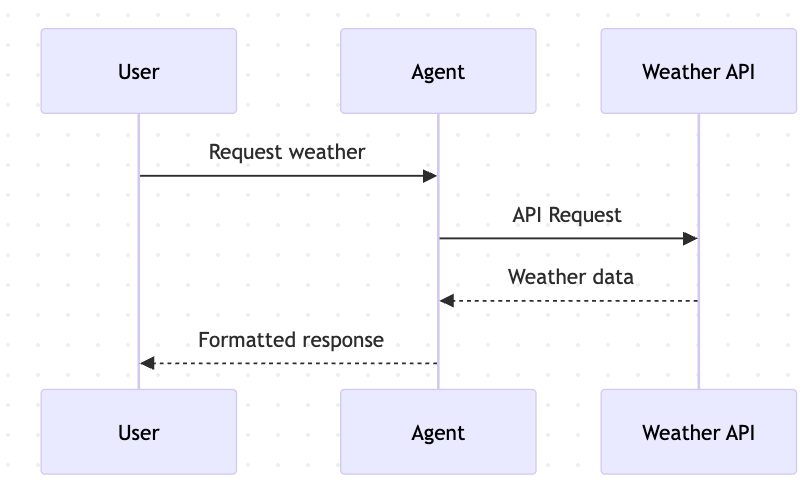
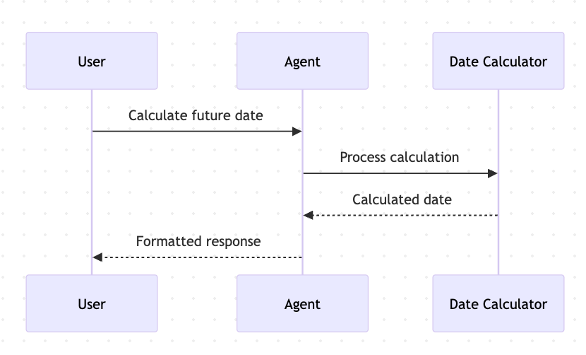
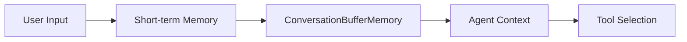
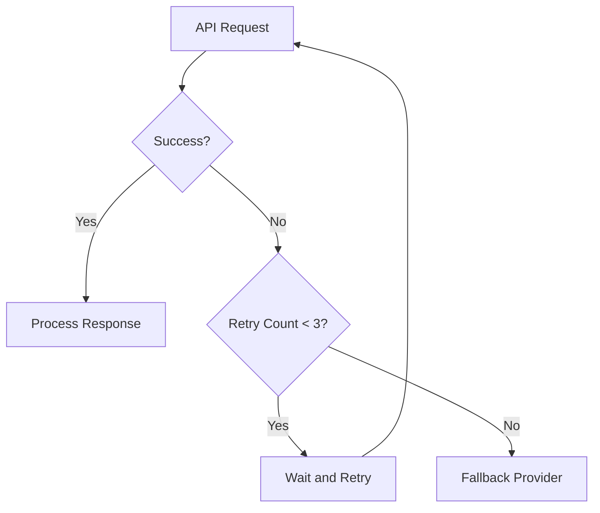

# LangChain Agents Architecture 🤖

## System Overview



## Agent Components

### 1. Base Agent Architecture



### 2. Tools Agent Architecture



## Tool Flow Diagrams

### Weather Tool Flow



### Date Calculator Flow



## Implementation Details

### LLM Provider Selection
1. **Google AI (Gemini)**
   - Model: `gemini-pro`
   - Best for: General purpose, fast responses
   - Rate limits: 15 requests/minute

2. **Anthropic (Claude)**
   - Model: `claude-3-haiku-20240307`
   - Best for: Complex reasoning
   - Rate limits: Varies by account

3. **Groq (Llama)**
   - Model: `llama-3.1-8b-instant`
   - Best for: Fast inference
   - Rate limits: 6,000 tokens/minute

### Available Tools

1. **Weather Information**
   - Input: `City,Country` format
   - Provider: OpenWeather API
   - Returns: Temperature, humidity, conditions

2. **Time Zone Converter**
   - Input: `Region/City` format
   - Provider: pytz library
   - Returns: Current time in specified timezone

3. **Date Calculator**
   - Input: `add N` or `subtract N`
   - Implementation: Python datetime
   - Returns: Calculated date with current date reference

4. **URL Shortener**
   - Input: Full URL
   - Provider: TinyURL API
   - Returns: Shortened URL

5. **Text Analyzer**
   - Input: Text string
   - Implementation: Custom Python
   - Returns: Character count, word count, metrics

### Memory System



### Error Handling



## Usage Examples

### Basic Tool Usage
```python
agent = ToolsLangChainAgent()

# Weather lookup
result = agent.run("What's the weather in London,UK?")

# Date calculation
result = agent.run("What date will it be in 14 days?")

# Text analysis
result = agent.run("Analyze this text: 'Hello, World!'")
```

### Complex Multi-Tool Tasks
```python
# Combining multiple tools
complex_task = """
1. Get weather in Tokyo
2. Calculate date in 2 weeks
3. Analyze the weather response
"""
result = agent.run(complex_task)
```

## Best Practices

1. **API Key Management**
   - Store keys in `.env` file
   - Never hardcode keys
   - Rotate keys periodically

2. **Error Handling**
   - Implement retries with backoff
   - Use provider fallbacks
   - Log errors for debugging

3. **Rate Limiting**
   - Respect API limits
   - Implement request throttling
   - Monitor usage

4. **Memory Management**
   - Clear memory when needed
   - Monitor token usage
   - Implement context windows 