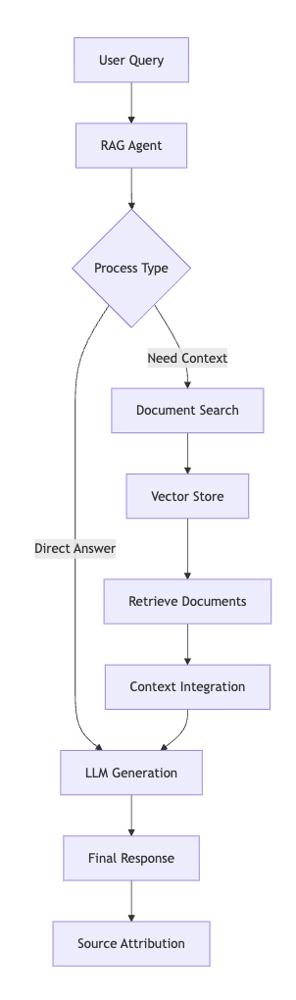
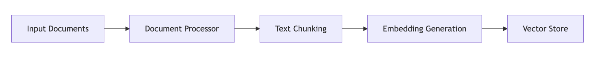
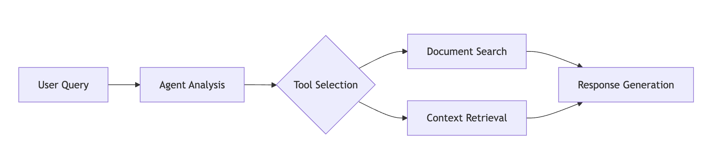

# Agentic RAG System

This project implements a Retrieval Augmented Generation (RAG) system combined with agentic capabilities, allowing for intelligent document search, context retrieval, and response generation.

## Architecture Overview

### Components

1. **Document Store (ChromaDocStore)**
   - Uses ChromaDB as the vector database
   - Implements document embedding using HuggingFace's sentence transformers
   - Provides similarity search capabilities

2. **Base RAG Agent (BaseRAGAgent)**
   - Combines LLM capabilities with tool usage
   - Manages conversation memory
   - Handles document retrieval and context generation

3. **Research RAG Agent (ResearchRAGAgent)**
   - Extends base agent with research-specific capabilities
   - Implements specialized tools for document analysis
   - Provides source attribution

## System Flow



## How It Works

1. **Document Processing**



2. **Query Processing**



## Key Features

1. **Intelligent Tool Usage**
   - Document search tool for finding relevant information
   - Context retrieval tool for deeper understanding
   - Memory system for conversation continuity

2. **Vector Search**
   - Semantic similarity search using embeddings
   - Configurable search parameters (k, fetch_k)
   - Efficient document retrieval

3. **LLM Integration**
   - Uses Groq's LLM models
   - Temperature and token control
   - Error handling and retry mechanisms

## Implementation Details

### Document Store
```python
ChromaDocStore
├── Embedding Model: paraphrase-MiniLM-L6-v2
├── Vector Dimensions: 384
└── Storage: Persistent ChromaDB
```

### Agent Structure
```python
BaseRAGAgent
├── LLM: Groq Chat Model
├── Tools
│   ├── Document Search
│   └── Context Retrieval
├── Memory: Conversation Buffer
└── Executor: ReAct Agent
```

## Usage Example

```python
# Initialize components
doc_store = ChromaDocStore()
doc_store.add_documents(documents)

# Create agent
agent = ResearchRAGAgent(
    vector_store=doc_store,
    model_name="llama-3.1-8b-instant",
    temperature=0.7
)

# Run queries
result = agent.run("What are the main challenges in AI safety?")
```

## Performance Considerations

1. **Embedding Generation**
   - Uses efficient sentence transformer models
   - Batch processing for large document sets
   - Persistent storage to avoid recomputation

2. **Search Optimization**
   - Configurable k-nearest neighbors
   - Fetch-k parameter for result diversity
   - Caching for frequent queries

3. **Memory Management**
   - Conversation buffer with size limits
   - Automatic cleanup of old contexts
   - Efficient storage of chat history

## Error Handling

- Graceful handling of LLM API errors
- Vector store connection recovery
- Invalid query protection
- Source tracking and validation

## Future Improvements

1. **Enhanced Retrieval**
   - Hybrid search (vector + keyword)
   - Cross-document reasoning
   - Dynamic context window

2. **Agent Capabilities**
   - Multi-agent collaboration
   - Self-improving prompts
   - Active learning from feedback

3. **System Optimization**
   - Parallel query processing
   - Caching improvements
   - Resource usage optimization

## Features

- **Document Processing**: Load and process various document types
- **Vector Storage**: Efficient document storage and retrieval using ChromaDB
- **Semantic Search**: Find relevant information using similarity search
- **Agentic Behavior**: Autonomous decision making and tool usage
- **Memory Management**: Track conversation history and context

## Quick Start

1. **Setup Environment**
   ```bash
   python -m venv .venv
   source .venv/bin/activate  # Windows: .venv\Scripts\activate
   pip install -r requirements.txt
   ```

2. **Configure API Keys**
   ```bash
   cp .env.example .env
   # Edit .env with your API keys
   ```

3. **Run Example**
   ```bash
   python examples/research_example.py
   ```

## Usage

```python
from src.agents import ResearchRAGAgent
from src.retrieval import ChromaDocStore

# Initialize vector store
store = ChromaDocStore()

# Create agent
agent = ResearchRAGAgent(
    vector_store=store,
    model_name="llama-3.1-8b-instant"
)

# Run queries
result = agent.run("What information do we have about AI safety?")
print(result["output"])
```

## Architecture

The system combines:
1. Document processing and embedding
2. Vector storage for efficient retrieval
3. LLM-powered agents for reasoning
4. Tool-based actions for autonomy

## Requirements

- Python 3.9+
- Groq API key
- ChromaDB
- LangChain 