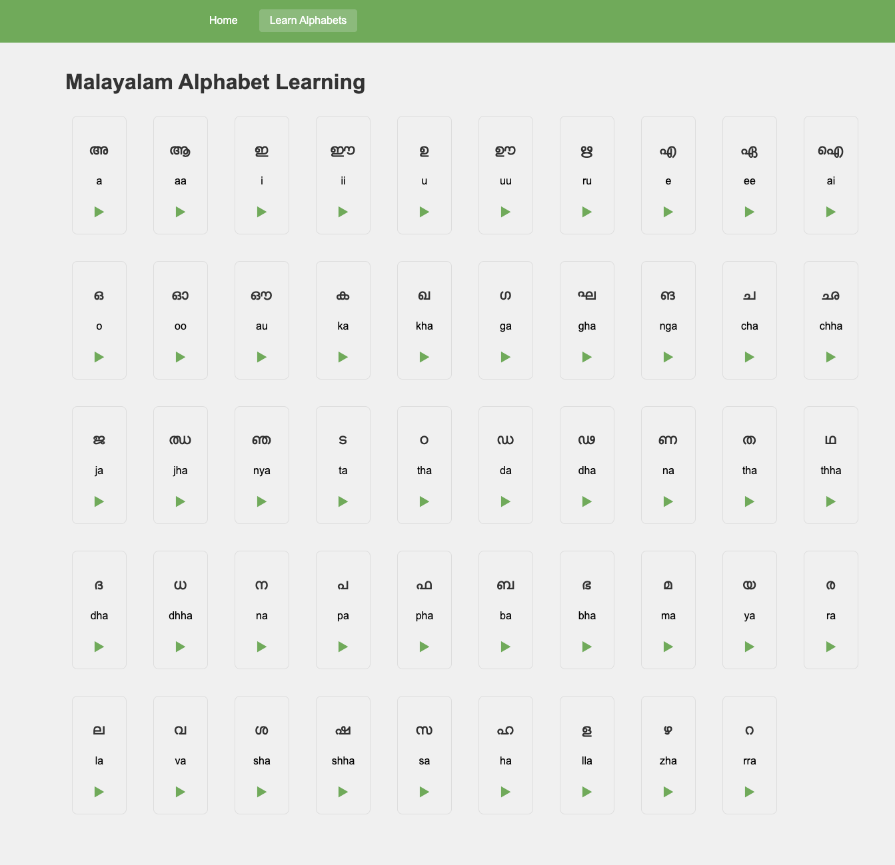
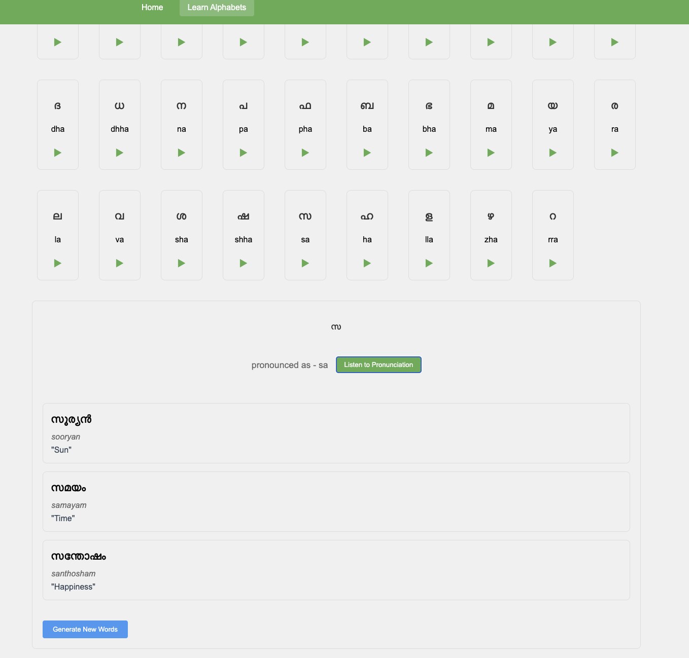
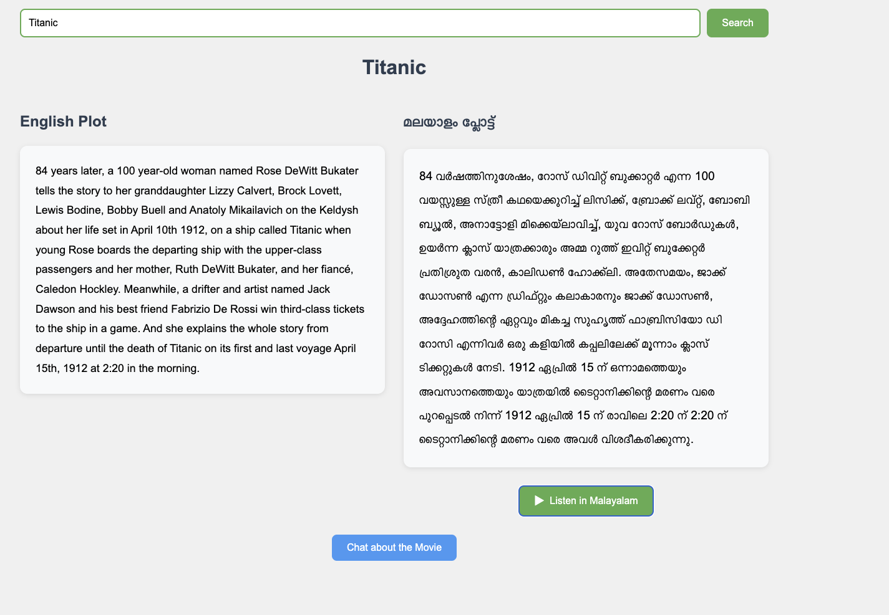
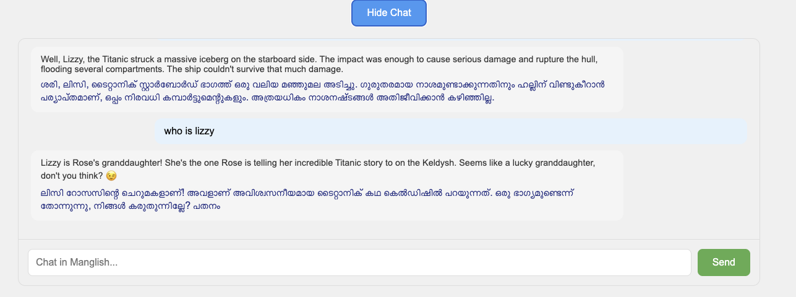

# Interactive Malayalam Learning App

An augmented reality application that helps users learn Malayalam through real-world object detection, interactive language exercises, and alphabet learning.

## Features

- Real-time object detection using device camera
- Malayalam translation with AR overlay
- Interactive practice exercises (Writing, Speaking, Listening)
- History tracking of scanned objects
- Audio generation for pronunciations
- Speech verification for practice
- **NEW: Interactive Alphabet Learning**
  - Complete Malayalam alphabet grid with transliterations
  - Audio pronunciations for each alphabet
  - AI-generated example words for practice
  - Dynamic word generation for expanded vocabulary
- **NEW: Movie Plot Learning**
  - Search for any movie to get its plot in Malayalam
  - Listen to plot narration in Malayalam
  - Interactive bilingual chat about the movie
  - Real-time English-Malayalam translations
  - AI-powered movie context-aware responses

## Screenshots

- Landing page with AR scanner/ camera capture and Image upload
    
- Object detection with Malayalam overlay
    
- Object detection with camera/Photo
    
- Image upload.
    
- Practice screen
    - Writing practice: Write the translation of detected word
        
    - Speaking Practice: practice prounciation
        
    - Listeniing Practice: Listen to a phrase and type the word
        
- History view: See the historic practice and retry learning.
    
- Alphabet Learning Screen
  - View all Malayalam alphabets with transliterations
  - Click to hear pronunciations
  - Generate example words for practice
    
    
- Movie Plot Learning Screen
  - Search any movie to get plot details
  - View plot in English and Malayalam, listen to malayalam
  - Chat with AI about the movie
    
    

## Tech Stack

### Frontend
- Vue.js 3
- Vite
- AR.js & A-Frame
- WebRTC for camera access

### Backend
- FastAPI (Python)
- SQLite3
- Google Gemini API for AI features
  - Object detection
  - **Word generation for alphabet learning**
- Whisper for speech recognition
- gTTS for text-to-speech
- **AI-powered word generation for alphabet practice**
- OMDB API for movie data
- Deep Translator for accurate Malayalam translations
- Google Gemini Pro for context-aware movie chat
- gTTS for Malayalam audio generation

## System Requirements
- Intel Core i5 processor / Mac book air m1
- 8GB RAM minimum
- Camera access for AR features
- Modern web browser (Chrome/Safari recommended)
- HTTPS for camera permissions

## Architecture

```
ar-language-app/
├── frontend/      # Vue.js web application
├── backend/       # FastAPI server
└── docker/        # Docker configuration
```

## Quick Start

1. Clone the repository:
```bash
git clone https://github.com/yourusername/ar-language-app.git
cd ar-language-app
```

2. Set up environment variables:
```bash
# In backend/.env
GEMINI_API_KEY=your_api_key_here
OMDB_API_KEY=your_omdb_api_key_here
```

3. Start the backend:
```bash
cd backend
python3 -m venv .venv
source .venv/bin/activate
pip install -r requirements.txt
uvicorn app.main:app --reload --port 8000
```

4. Initialize the database and alphabet data:
```bash
cd backend

# Create and initialize the database
python -m app.utils.create_db

# Generate alphabet audio files
python -m app.utils.generate_alphabet_audio

# Seed the database with Malayalam alphabets
python -m app.utils.seed_alphabets
```

5. Start the frontend:
```bash
cd frontend/vue_app
npm install
npm run dev
```

6. Access the application:
   - Open https://localhost:3000 in your browser
   - Accept the SSL certificate warning
   - Grant camera permissions when prompted

## Database Structure

### Alphabets Table
```sql
CREATE TABLE alphabets (
    id INTEGER PRIMARY KEY,
    malayalam_char TEXT UNIQUE,
    english_transliteration TEXT,
    audio_url TEXT
);
```

### Generated Words Table
```sql
CREATE TABLE generated_words (
    id INTEGER PRIMARY KEY,
    alphabet_id INTEGER,
    word TEXT,
    english_translation TEXT,
    pronunciation TEXT,
    timestamp DATETIME DEFAULT CURRENT_TIMESTAMP,
    FOREIGN KEY (alphabet_id) REFERENCES alphabets (id)
);
```

### Movie Plots Table
```sql
CREATE TABLE movie_plots (
    id INTEGER PRIMARY KEY,
    movie_name TEXT UNIQUE,
    english_plot TEXT,
    malayalam_plot TEXT,
    audio_url TEXT,
    timestamp DATETIME DEFAULT CURRENT_TIMESTAMP
);
```

## Audio Files Structure
```
backend/
└── static/
    └── audio/
        ├── alphabets/
        │   └── ...
        └── movies/
            ├── titanic.mp3
            ├── avatar.mp3
            └── ...
```

## Workflow

1. **Object Detection**
   - Click "Start AR Scan"
   - Point camera at object
   - Click "Detect Object"
   - View Malayalam translation overlay

2. **Practice**
   - Click "Practice" after detection
   - Try writing exercises
   - Practice pronunciation
   - Listen to generated phrases

3. **History**
   - View previously scanned objects
   - Access practice exercises for any item
   - Track learning progress

4. **NEW: Alphabet Learning**
   - Access from landing page
   - Click any alphabet to:
     - Hear pronunciation
     - See English transliteration
     - View example words
   - Generate new practice words
   - Track learning progress

5. **Movie Plot Learning**
   - Search for any movie
   - Read plot in English and Malayalam
   - Listen to Malayalam narration
   - Chat with AI about movie details
   - Get bilingual responses
   - Practice comprehension through conversation

## Contributing

1. Fork the repository
2. Create your feature branch (`git checkout -b feature/AmazingFeature`)
3. Commit your changes (`git commit -m 'Add some AmazingFeature'`)
4. Push to the branch (`git push origin feature/AmazingFeature`)
5. Open a Pull Request

## License

This project is licensed under the MIT License - see the individual README files in frontend and backend directories for details.