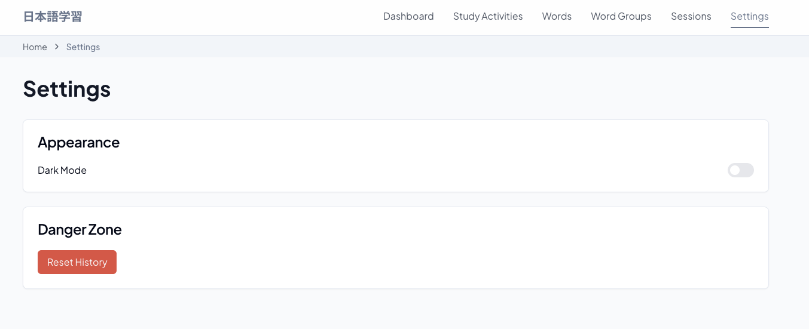

# Japanese Language Learning Portal (UI)

A modern, desktop-focused Japanese language learning platform built with React and TypeScript. The application serves as a central hub for launching study activities, managing vocabulary, and tracking learning progress.

## 📸 Screenshots

### Dashboard

*Main dashboard showing learning progress and recent activities*

### Study Activities

*Study Activities*

### Words

*Words*

### Word Groups

*Word Groups*

### Study Sessions

*Study Sessions*

### Dark Mode

*Application interface in dark mode*

### Settings

*Settings*

## 🚀 Features

- **Study Activity Hub**
  - Launch various learning activities
  - Track session progress
  - View activity history

- **Vocabulary Management**
  - Browse Japanese words with kanji, romaji, and English translations
  - Audio playback for pronunciation
  - Organize words into groups
  - Track correct/incorrect answers

- **Progress Tracking**
  - Session history
  - Performance analytics
  - Learning statistics

- **User Experience**
  - Dark/Light theme toggle
  - Intuitive navigation
  - Breadcrumb navigation

## 🛠️ Tech Stack

- **Frontend Framework:** React.js
- **Language:** TypeScript
- **Styling:** Tailwind CSS
- **Component Library:** shadcn/ui
- **Build Tool:** Vite.js
- **Router:** React Router DOM
- **State Management:** React Query

## 📦 Installation

1. Clone the repository:
```bash
git clone <repository-url>
cd lang-portal-UI
```

2. Install dependencies:
```bash
npm install
```

3. Start development server:
```bash
npm run dev
```

## 🗺️ Project Structure

```
lang-portal-UI/
├── src/
│   ├── components/
│   │   ├── layout/       # Layout components
│   │   └── ui/          # UI components
│   ├── pages/           # Page components
│   ├── hooks/           # Custom hooks
│   ├── lib/            # Utilities
│   └── App.tsx         # Main app component
├── public/             # Static assets
└── screenshots/        # Application screenshots
```

## 📱 Routes

- `/dashboard` - Overview and progress
- `/study-activities` - Available learning activities
- `/study-activities/:id` - Activity details
- `/words` - Vocabulary list
- `/words/:id` - Word details
- `/groups` - Word groups
- `/groups/:id` - Group details
- `/sessions` - Study sessions
- `/settings` - Application settings

## 🖼️ Adding Screenshots

To add new screenshots:

1. Create screenshots using your preferred tool
2. Save them in the `screenshots` directory
3. Use descriptive names (e.g., `dashboard-dark-mode.png`)
4. Update the README.md to reference new screenshots
5. Add appropriate captions and descriptions

Screenshot naming convention:
```
screenshots/
├── feature-name.png
├── feature-name-dark.png
└── feature-name-mobile.png
```

## 🤝 Contributing

1. Fork the repository
2. Create your feature branch: `git checkout -b feature/AmazingFeature`
3. Commit your changes: `git commit -m 'Add AmazingFeature'`
4. Push to the branch: `git push origin feature/AmazingFeature`
5. Open a Pull Request

## 📄 License

This project is licensed under the MIT License - see the [LICENSE](LICENSE) file for details.

## 🔑 Environment Variables

Create a `.env` file in the root directory:

```env
VITE_API_URL=http://localhost:3000
VITE_ASSETS_URL=http://localhost:3000/assets
```

## 📚 Documentation

Additional documentation:
- [Component Documentation](docs/components.md)
- [API Integration Guide](docs/api.md)
- [Styling Guide](docs/styling.md)
- [Contributing Guide](docs/contributing.md)
