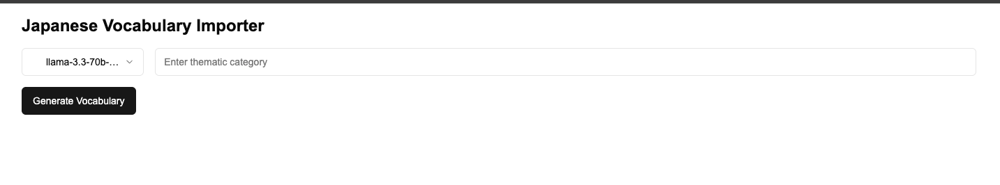
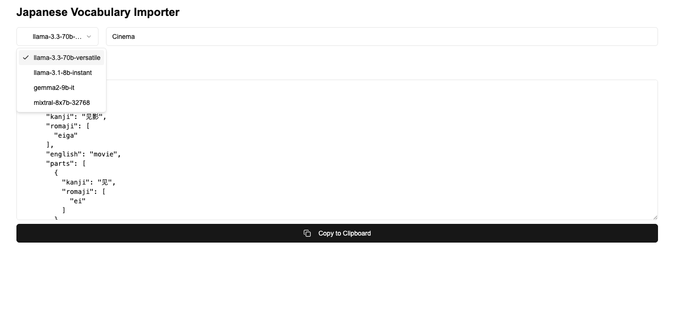
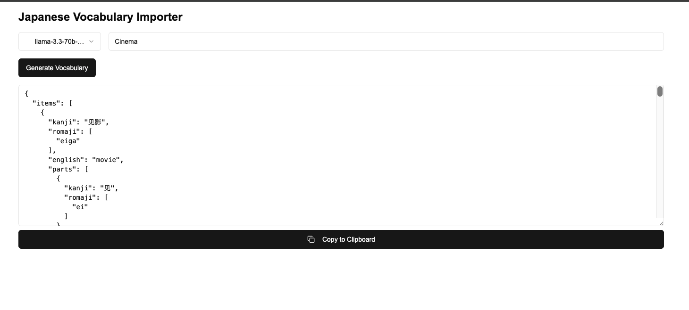

# Japanese Vocabulary Importer

A Next.js application that uses Groq LLM to generate structured Japanese vocabulary lists based on thematic categories.

## 📸 Screenshots

### Main Interface



*Vocabulary generation interface with model selection and category input*

### Generated Output

*JSON output with copy functionality*

## 🚀 Features

- Groq LLM integration for vocabulary generation
- Multiple model selection options:
  - llama-3.3-70b-versatile
  - llama-3.1-8b-instant
  - gemma2-9b-it
  - mixtral-8x7b-32768
- Thematic category-based vocabulary generation
- Structured JSON output with:
  - Kanji
  - Romaji
  - English translation
  - Word parts analysis
- One-click clipboard copy functionality
- Success notifications

## 🛠️ Tech Stack

- **Framework:** Next.js 14
- **Language:** TypeScript
- **Styling:** Tailwind CSS
- **UI Components:** shadcn/ui
- **Form Handling:** react-hook-form
- **AI Integration:** Groq AI SDK
- **Validation:** Zod

## 📦 Installation

1. Clone the repository:
```bash
git clone <repository-url>
cd lang-portal-vocab-importer
```

2. Install dependencies:
```bash
npm install
```

### Troubleshooting

If you encounter dependency conflicts during installation:

```bash
# Clean installation
rm -rf node_modules package-lock.json
npm cache clean --force
npm install

# Alternative: Use legacy peer deps if needed
npm install --legacy-peer-deps
```

3. Set up environment variables:
```bash
cp env.local .env.local
# Add your Groq API key to .env.local
```

4. Run the development server:
```bash
npm run dev
```

## 🗄️ Project Structure

```
lang-portal-vocab-importer/
├── app/
│   ├── api/
│   │   └── generate-vocabulary/ # API endpoints
│   ├── layout.tsx
│   └── page.tsx
├── components/
│   ├── ui/                    # UI components
│   ├── vocabulary-importer.tsx
│   └── theme-provider.tsx
├── lib/
│   └── utils.ts
├── public/
│   └── screenshots/          # Application screenshots
└── styles/
    └── globals.css
```

## 🔧 Configuration

### Environment Variables

Create a `.env.local` file:
```env
GROQ_API_KEY=your_groq_api_key_here
```

### Tailwind Configuration

Customize the theme in `tailwind.config.js`:
```js
module.exports = {
  darkMode: ["class"],
  content: [
    "./pages/**/*.{ts,tsx}",
    "./components/**/*.{ts,tsx}",
    "./app/**/*.{ts,tsx}",
  ],
  // ...rest of config
}
```

## 📝 API Usage

### Generate Vocabulary
```typescript
POST /api/generate-vocabulary
Content-Type: application/json

{
  "model": "llama-3.3-70b-versatile",
  "category": "food"
}
```

Response:
```json
[
  {
    "kanji": "寿司",
    "romaji": "sushi",
    "english": "sushi",
    "parts": [
      {
        "kanji": "寿",
        "romaji": ["kotobuki"]
      },
      {
        "kanji": "司",
        "romaji": ["shi"]
      }
    ]
  }
]
```

## 🤝 Contributing

1. Fork the repository
2. Create your feature branch: `git checkout -b feature/amazing-feature`
3. Commit your changes: `git commit -m 'Add amazing feature'`
4. Push to the branch: `git push origin feature/amazing-feature`
5. Open a Pull Request

## 📜 License

This project is licensed under the MIT License - see the [LICENSE](LICENSE) file for details.

## 🔑 Keywords

japanese vocabulary, language learning, groq llm, next.js, vocabulary generator, language tools

## 👥 Contact

Your Name - [@yourgithub](https://github.com/gkcodebase)
