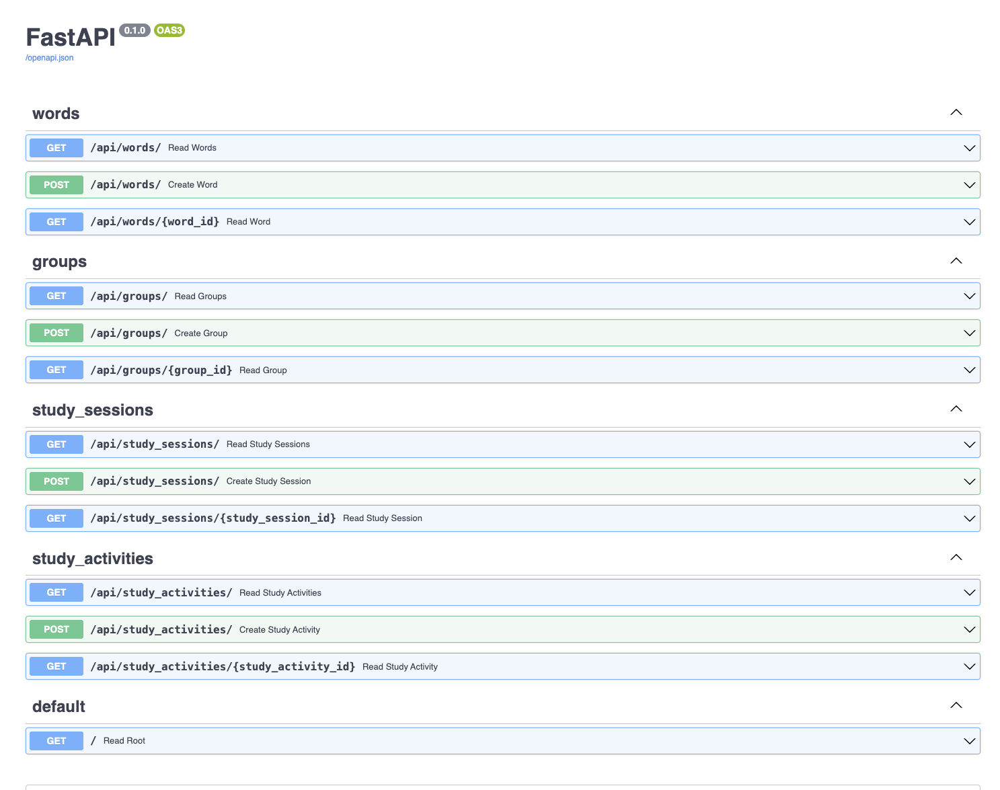
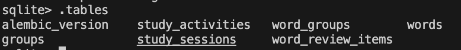
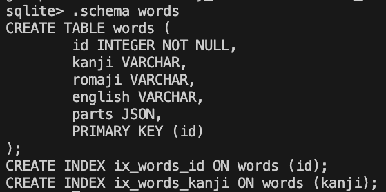
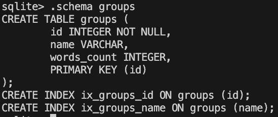

# FastAPI Backend for Language Learning Portal

## Features
- RESTful API implementation
- SQLAlchemy ORM integration
- Alembic migrations
- Pydantic data validation
- SQLite database

## Setup & Installation

1. Create virtual environment:
```bash
python -m venv venv
source venv/bin/activate  # Unix
venv\Scripts\activate     # Windows
```

2. Install dependencies:
```bash
pip install -r requirements.txt
```

3. Initialize database and migrations:
```bash
# Initialize Alembic
alembic init alembic

# Create initial migration
alembic revision --autogenerate -m "Initial migration"

# Run migrations
alembic upgrade head
```

4. Start server:
```bash
uvicorn app.main:app --reload
```

## Project Structure
```
backend-fastapi/
├── alembic/            # Database migrations
├── app/
│   ├── crud.py        # Database operations
│   ├── main.py        # FastAPI application
│   ├── models.py      # SQLAlchemy models
│   └── schemas.py     # Pydantic models
├── seed/              # Seed data
└── tests/            # Test cases
```

## API Documentation
Available at `http://localhost:8000/docs` when server is running

## 📸 Screenshots

### API Documentation


*Interactive API documentation with Swagger UI*

### Database Schema






