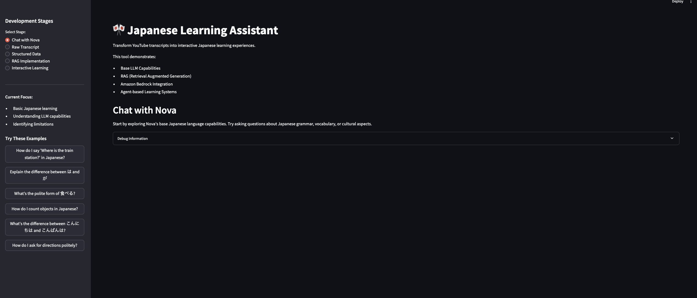
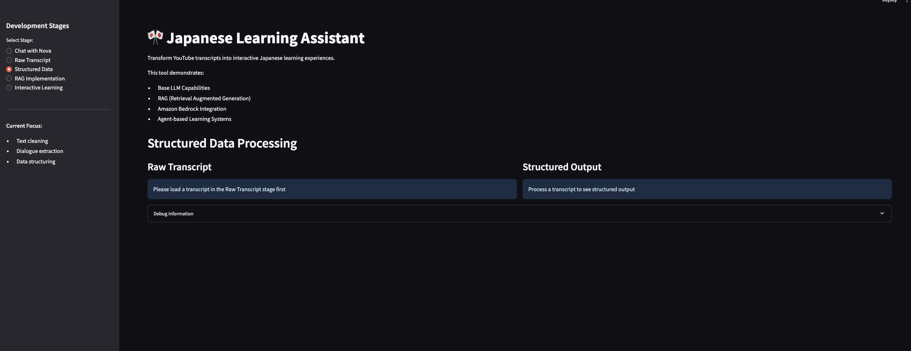
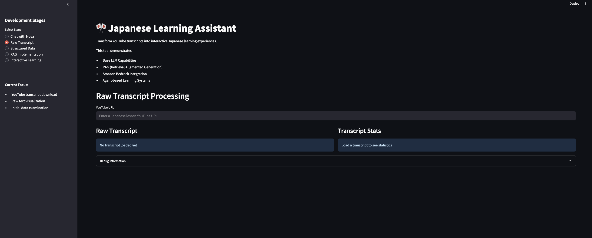
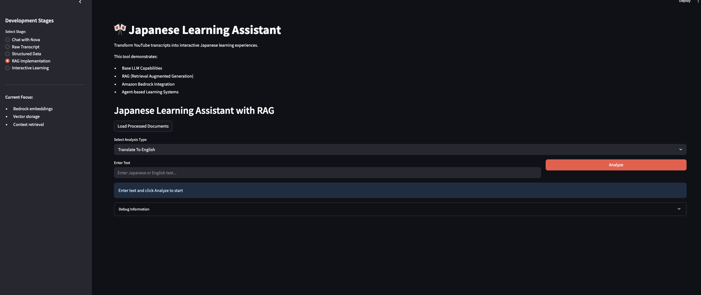
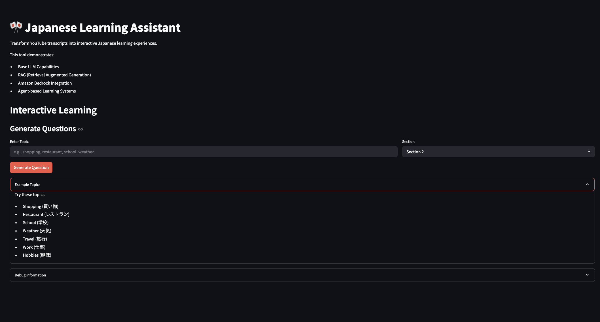

# Japanese Language Learning Assistant

A progressive learning tool that demonstrates RAG and agents for enhanced language learning using real Japanese lesson content.

## 📸 Screenshots

### Interactive Learning Interface




*Interactive learning session with audio playback*

### RAG Implementation


### Chat Interface


## 🎯 Business Goals

- Create a progressive learning tool demonstrating RAG and agents
- Enhance language learning with real Japanese content
- Show evolution from basic LLM to contextual learning assistant
- Help students understand technical implementation and benefits

## 🛠️ Technical Stack

- **Cloud Services:**
  - Amazon Bedrock (Nova, Titan)
  - Amazon Polly
  - AWS SDK (boto3)

- **Backend:**
  - Python
  - FastAPI
  - ChromaDB
  - SQLite
  - YouTube Transcript API

- **Frontend:**
  - Streamlit
  - Pandas (Data Visualization)

## 📦 Installation

1. Clone the repository:
```bash
git clone <repository-url>
cd listening-com
```

2. Set up virtual environment:
```bash
python -m venv venv
source venv/bin/activate  # For Mac
```

3. Install dependencies:
```bash
pip install -r backend/requirements.txt
```

4. Configure AWS credentials:
```bash
aws configure
```

## 🚀 Getting Started

1. Start the Streamlit app:
```bash
cd frontend
streamlit run main.py
```

2. Access the application:
```
http://localhost:8501
```

## 📂 Project Structure

```
listening-com/
├── backend/           # Backend implementation
├── frontend/          # Streamlit frontend
└── screenshots/       # Application screenshots
```

## 📊 Features

1. **Base LLM Capabilities**
   - Direct interaction with Nova
   - Basic conversation handling

2. **Raw Transcript Processing**
   - YouTube transcript extraction
   - Text preprocessing

3. **Structured Data**
   - JSON formatting
   - Data validation

4. **RAG Implementation**
   - Context retrieval
   - Enhanced responses

5. **Interactive Features**
   - Audio generation
   - Multiple-choice questions
   - Progress tracking

## 📄 License

MIT License - see [LICENSE](LICENSE)

## 🤝 Contributing

1. Fork the repository
2. Create feature branch (`git checkout -b feature/amazing-feature`)
3. Commit changes (`git commit -m 'Add amazing feature'`)
4. Push to branch (`git push origin feature/amazing-feature`)
5. Open a Pull Request