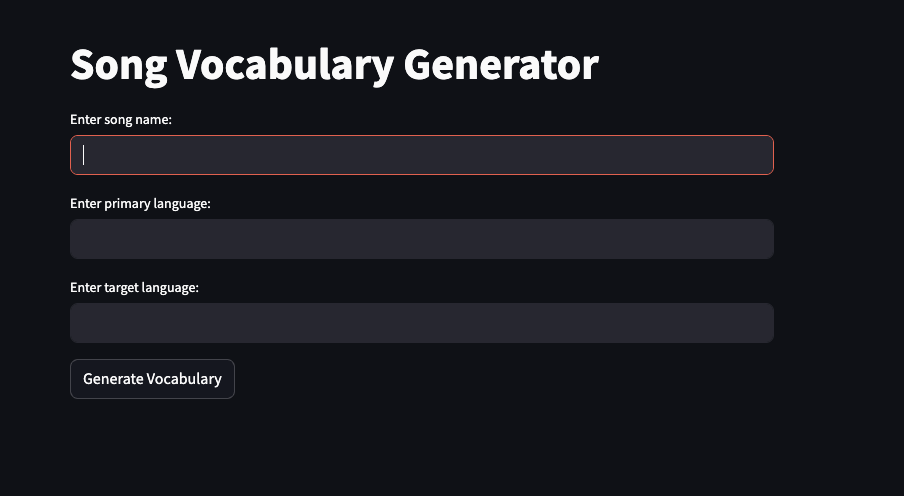
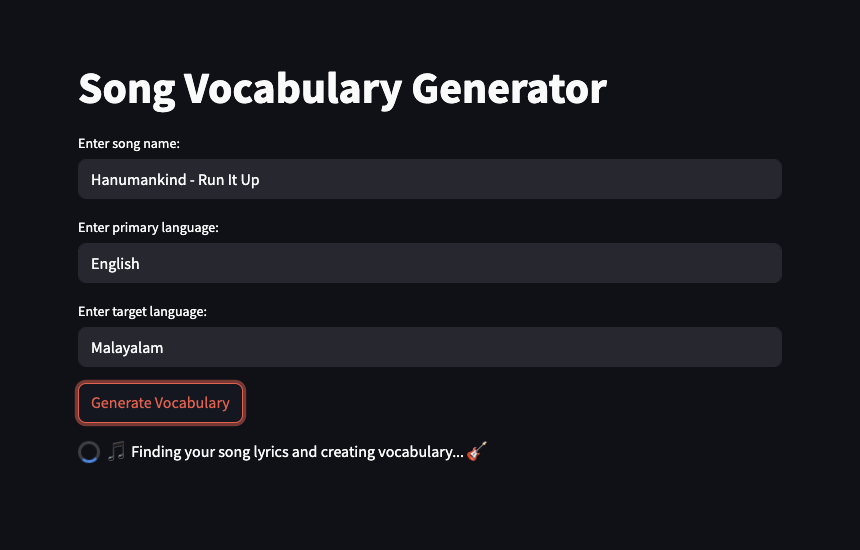
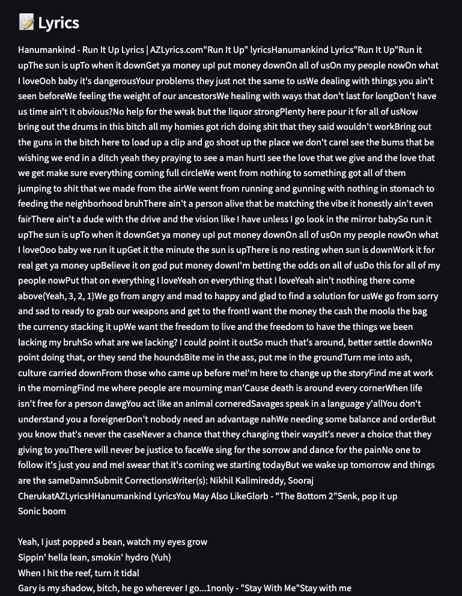

# Song To Vocab APP

A FastAPI and Streamlit application that extracts vocabulary from songs and provides translations for language learning.

## 📸 Screenshots

### Search Interface

*Main search interface with language selection*

### Results View


*Vocabulary extraction and translation results*

### Vocab Details

*Detailed view of translations with examples*

## 🛠️ Technical Stack
- Frontend: Streamlit
- Backend: FastAPI
- LLM: Ollama (llama3.2:1b)
- Search: SerpAPI
- Additional Tools:
  - BeautifulSoup4 for web scraping
  - Python-dotenv for environment management
  - Pydantic for data validation

## 🚀 Getting Started

### Prerequisites
1. Install Ollama:
```bash
brew install ollama
```

2. Pull required model:
```bash
ollama pull llama3.2:1b
```

### Setup

1. Create virtual environment:
```bash
python3 -m venv .venv
source .venv/bin/activate
```

2. Install dependencies:
```bash
pip install -r requirements.txt
```

3. Configure environment variables:
```bash
# Create .env file
cat << EOF > .env
SERP_API_KEY=your_serpapi_key_here
EOF
```

4. Start the services:
```bash
# Terminal 1 - Start Ollama
ollama serve

# Terminal 2 - Start Backend
uvicorn main:app --reload

# Terminal 3 - Start Frontend
streamlit run ui.py
```

## 💡 Usage

1. Enter song details:
   - Song name and artist (e.g., "Shape of You by Ed Sheeran")
   - Select primary language (song's language)
   - Select target language (translation language)

2. Click "Generate Vocabulary" to:
   - Extract lyrics
   - Generate vocabulary list
   - Get translations

## 📁 Project Structure
```
song-vocab/
├── screenshots/            # Application screenshots
├── tools/
│   ├── search_web.py      # Lyrics search functionality
│   ├── get_page_content.py # Content extraction
│   └── extract_vocabulary.py # Vocabulary processing
├── main.py                # FastAPI application
├── ui.py                  # Streamlit interface
└── requirements.txt       # Project dependencies
```

## 🔑 Environment Variables

Required in `.env`:
```properties
SERP_API_KEY=your_serpapi_key_here  # Get from serpapi.com
```


## 🤝 Contributing

1. Fork the repository
2. Create your feature branch
3. Commit your changes
4. Push to the branch
5. Open a Pull Request

## 📝 License

This project is licensed under the MIT License - see the [LICENSE](LICENSE) file for details.