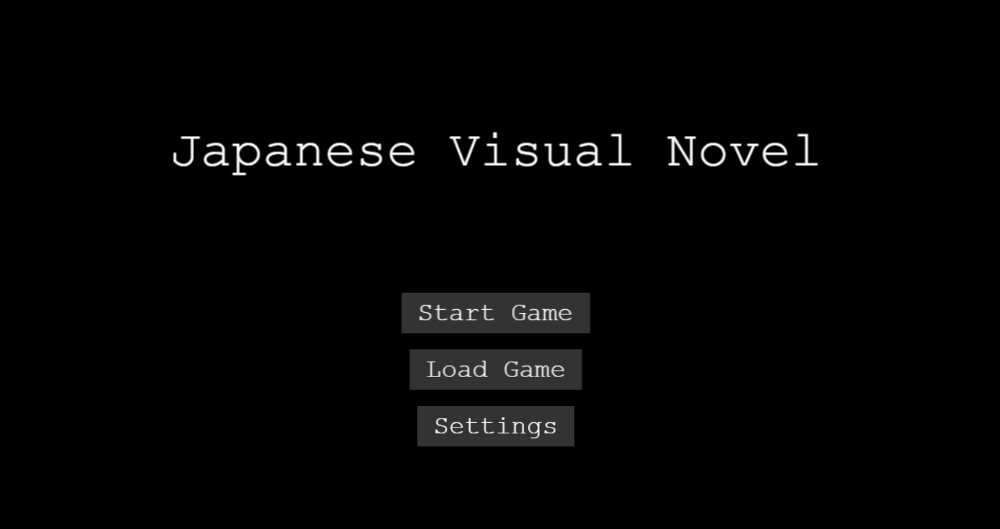
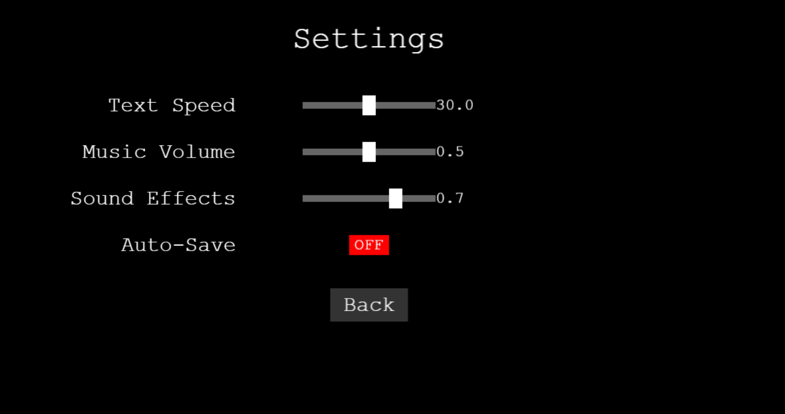
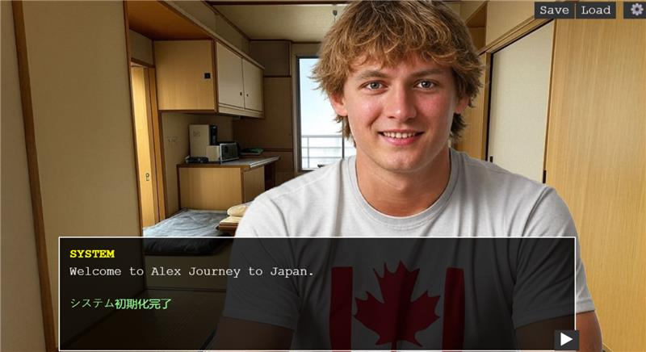
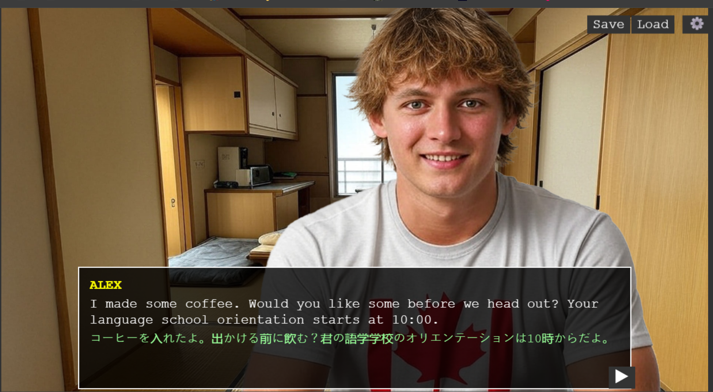

# Japanese Learning Visual Novel

A web-based visual novel game designed to teach Japanese language through interactive storytelling. Follow your character's journey in Japan while learning the language through immersive scenarios and practical conversations.

## Features

### Core Gameplay
- Interactive visual novel format
- Branching storylines based on player choices
- Japanese language learning integration
- Character interaction system
- Save/Load game functionality
- Settings customization

### Language Learning
- Progressive difficulty levels
- Vocabulary and grammar explanations
- Cultural notes and insights
- Practice exercises and quizzes
- Real-world conversation scenarios
- JLPT-aligned content (N5-N4 level)

### Technical Features
- Built with Phaser 3 game framework
- Responsive web design
- Audio system for music and sound effects
- Text animation system
- Persistent game save system
- Debug tools for development

## Recent Feature Updates
- Added new character interaction system
- Improved text animation system
- Enhanced audio system with new sound effects

## Current Development Status
- Version 1.2.0 in progress
- Implementing new story branches
- Adding more vocabulary and grammar exercises

## Requirements

### Prerequisites
- Node.js (v14.0 or higher)
- npm (v6.0 or higher)
- Web browser with WebGL support
- 200MB available storage space

### Development Tools
- Visual Studio Code (recommended)
- Git for version control
- Web browser developer tools

## Installation

1. Clone the repository:
```bash
git clone https://github.com/yourusername/japanese-visual-novel.git
cd japanese-visual-novel
```

2. Install dependencies:
```bash
npm install
```

3. Start the development server:
```bash
npm start
```

4. Open your browser and navigate to:
```
http://localhost:8080
```

## Project Structure

```
visual-novel/
├── public/
│   ├── index.html
│   ├── assets/
│   │   ├── audio/
│   │   └── images/
│   └── scenes/
├── src/
│   ├── components/
│   ├── scenes/
│   ├── systems/
│   └── game.js
├── package.json
└── webpack.config.js
```

## Game Controls

- **Left Click/Tap**: Advance dialog, make choices
- **Right Click/ESC**: Open game menu
- **S**: Quick save
- **L**: Quick load
- **Space**: Auto-advance text
- **Ctrl+S**: Open settings

## Development

### Building for Production
```bash
npm run build
```

### Running Tests
```bash
npm test
```

### Debug Tools
Open browser console (F12) and use:
```javascript
debugGame.inspectDialog()    // Check dialog state
debugGame.testDialog()       // Test dialog system
debugGame.getCurrentScene()  // View active scenes
```

## Story Structure

The game features three main story branches:
- **Study Path**: Focus on academic Japanese
- **Culture Path**: Explore Japanese traditions
- **Practical Path**: Learn everyday conversation

Each path contains:
- 5 main scenes
- Multiple choice points
- Language exercises
- Cultural notes
- Vocabulary lists
- Grammar explanations

## 📸 Game Screenshots

### Home Screen

*Main menu with start game, load game, and settings options*

### Settings Interface

*Customize game settings including text speed, audio, and language preferences*

### Gameplay Scenes

*Interactive classroom dialogue with language learning elements*



## Contributing

1. Fork the repository
2. Create a feature branch
3. Commit changes
4. Push to branch
5. Open a Pull Request

### Contribution Guidelines Clarification
- Ensure your code follows the project's coding standards
- Write clear and concise commit messages
- Include relevant tests for new features or bug fixes

## License

This project is licensed under the MIT License - see the LICENSE file for details.

## Acknowledgments

- Phaser.js game framework
- Japanese language learning resources
- Sound effects and music assets
- Character and background artists

## Support

For issues and feature requests, please use the GitHub issue tracker.

## Contact

- Email: gokulgk1200@gmail.com
